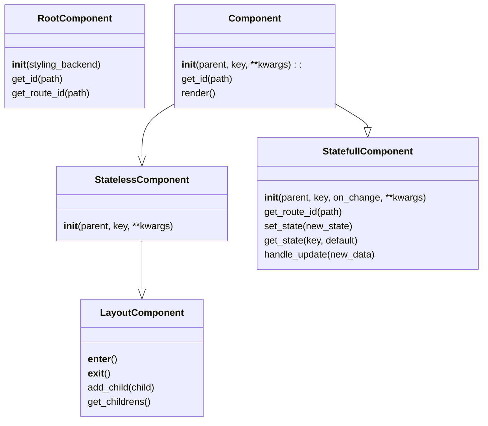

# FluidFrame

<p align="center">
  
</p>


FluidFrame is a powerful, pythonic web application framework that embraces the simplicity and capability of hypermedia concepts. It combines Python's elegance with HTMX's innovative approach to create dynamic, interactive web applications without the need for complex JavaScript.

## Key Features

- **Hypermedia-Driven**: Utilizes HTMX to implement Hypermedia as the Engine of Application State (HATEOAS), allowing the server to control the flow of information and interactions.

- **Component-Based Architecture**: Build your UI with reusable, Python-defined components, promoting code organization and reusability.

- **Pythonic HTML Generation**: Create HTML structures using Python syntax, making your code more consistent and easier to maintain.

```python
content = html(
    div(
        h1("Welcome to FluidFrame", cls="heading"),
        p("Build powerful web apps with Python elegance", cls="description"),
        a("Get Started", href="/docs", cls="btn"),
        cls="container", id="welcome_section"
    )
)
```
- **Automatic Route Generation**: Simplify your development process with automatic route generation for HTMX-enabled components.
- **Full-Stack Python**: Develop entire web applications using Python, from backend logic to frontend interactions, without writing JavaScript or HTML.
- **High Performance**: Utilizes Cython for core HTML tag generation, offering speed comparable to or faster than traditional templating engines like Jinja2.
Pre-built Components: Jump-start your development with a library of pre-built, customizable UI components.
- **Pre-built Components**: Jump-start your development with a library of pre-built, customizable UI components which are similar to that of `streamlit` so for those who knows it fluidframe becomes a piece of cake **without the full code rerun of streamlit**.

## Example
Here's a simple example of a text component in FluidFrame with and without a tooltip:
```python
class Text(StatelessComponent):
    def __init__(self, parent: Union[Component, Root], body: str, help: Optional[str]=None) -> None:
        super().__init__(parent)
        self.body = body
        self.help = help
        
    def render(self) -> str:
        if self.help:
            return div(
                p(self.body, cls="text-sm text-gray-900 dark: text-white"),
                add_tooltip(self.id, self.help, cls="invisible opacity-0 absolute z-10 px-3 py-2 text-sm font-medium text-white bg-gray-900 rounded-lg shadow-sm transition-opacity duration-500"),
                id=self.id, cls="relative"
            )
           
        return div(
            p(self.body, cls="text-sm text-gray-900 dark: text-white"), 
            id=self.id, cls="relative"
        )
```

---

## Developments

- FluidFrame utilizes a Cython implementation for HTML tags, resulting in a speed boost for small scale template rendering when compared to Jinja2.

    In a performance test involving 1,000,000 iterations, FluidFrame's tag rendering was approximately 9.58 times faster than Jinja2 at small scale rendering.

    | Iterations | fluidframe tags | jinja2 |
    |---|---|---|
    1,000,000|0.7361083286003123s|7.126994657999967s|

    This speed advantage can be crucial for our specific case of htmx response rendering as the scale and depth of required html will be smaller.

    At the same time when child elements are higher to loop through (>10000) Jinja2 is consistently faster. But since we are using HTMX and its support for server sent events allow us to sent the data dynamically as its been generated and rendered there by closing the gap.

---

## Why FluidFrame?

FluidFrame simplifies web development by leveraging the power of hypermedia and the simplicity of Python. It allows developers to create interactive, full-stack web applications without the complexity of traditional JavaScript frameworks. By using HTMX under the hood, FluidFrame enables rich, dynamic user experiences while keeping your codebase clean, maintainable, and purely Python-based.

Whether you're building a small web app or a large-scale application, FluidFrame provides the tools and structure to make your development process smooth and efficient.

Get started with FluidFrame today and experience the joy of building modern web applications with pure Python!

---

## Prerequisites
Before you begin, ensure you have the following installed on your system:

- Python 3.8 or higher
- Poetry (for dependency management)
- A C compiler (GCC on Linux/macOS, or Microsoft Visual C++ on Windows)
    - On Windows: You'll need Microsoft Visual C++. The easiest way to get this is to install "Build Tools for Visual Studio".
    - On macOS: You can use Xcode's command-line tools. Install them by running `xcode-select --install` in the terminal.
    - On Linux: You likely already have GCC installed. If not, you can install it using your distribution's package manager (e.g., `sudo apt-get install gcc` on Ubuntu).

    **Note:** Python development headers are usually included with Python, but on some systems, you might need to install them separately. On Ubuntu or Debian, for example, you might need to install `python3-dev`.


## Installation Steps

1. Clone the repository:

```bash
git clone https://github.com/AswanthCManoj/fluidframe.git
cd fluidframe
```

2. Install the project dependencies using Poetry:

```bash
poetry install
```

3. Install node packages and initialize:

```bash
poetry run python -m fluidframe_cli --init
```

This step compiles the Cython modules and places the resulting binary files in the appropriate directories.

4. Verify the installation:
```bash
poetry shell
python
from fluidframe.utilities.cython_tags import div

print(div("This is a test"))
```

If you see "Installation successful!" printed without any errors, the installation is complete.

---

Component Base Classes in `fluidframe/components/base_components.py`:



---


## Components

| Component Type | Methods | Description | File |
|---|---|---|---|
| **Stateless Component** | `Text`, `Markdown`, `Latex`, `Title`, `Header`, `SubHeader`, `Caption`, `Code`, `Image`, `Audio`, `Video`, `Diagram` | For simple display components that don't need to manage state. | `fluidframe/components/view_components.py` | 
| **Stateful Component**  | `Button`, `TextInput`, `TextArea`, `Slider`, `SelectBox`, `MultiSelectBox`, `CheckBox`, `Radio`, `DateInput`, `TimeInput`, `FileUploader`, `ColorPicker()`, `DownloadButton`, `Progress`, `Spinner`, `Status`, `Form` | For components that need to manage and update their own state and respond to user interactions. | `fluidframe/components/statefull_components.py` | 
| **Layout Component** | `Column`, `Container`, `SideBar`, `Expander`, `Empty`, `NavBar` | For components that can contain other components, including creating layout, stateful, and stateless components. | `fluidframe/components/layout_components.py` | 

**Note**: 
- All the layout components will have access to methods to generate components of type of itself and all other components at any level. 

- The component will automatically gets added to the childrens list along with their id's based on hashing of their position in the DOM tree.

- Only the statefull components will get an assigned htmx route based on the `on_change` method passed to it the state updates are detected by htmx on the client side and simply sends an ajax request to the server to get the newly updated rendered html and depending on the functionality htmx swaps or replaces targets with the newly returned elements.
