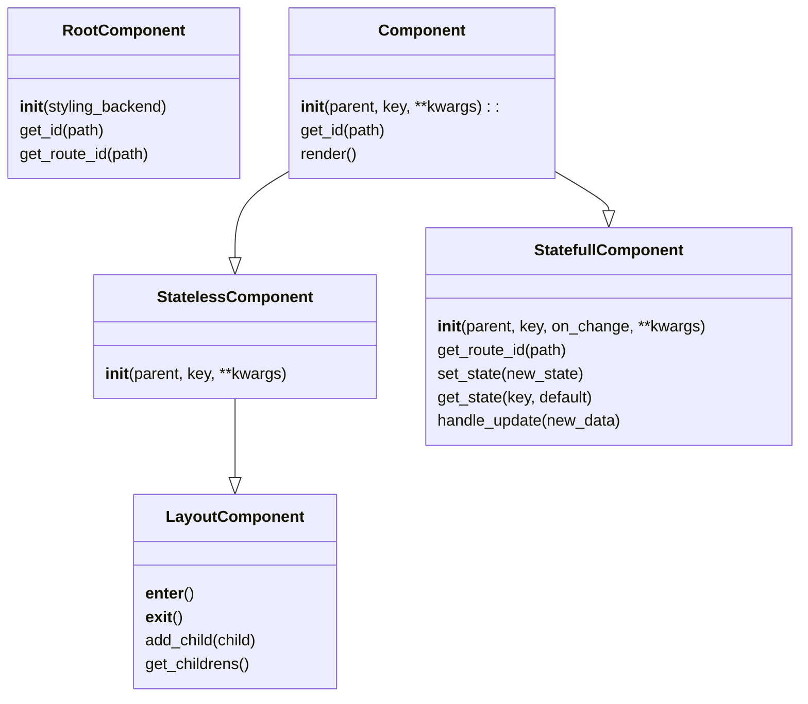

Component Base Classes in `fluidframe/components/base_components.py`:

---

## Components

| Component Type | Methods | Description | File |
|---|---|---|---|
| **Stateless Component** | `Text`, `Markdown`, `Latex`, `Title`, `Header`, `SubHeader`, `Caption`, `Code`, `Image`, `Audio`, `Video`, `Diagram` | For simple display components that don't need to manage state. | `fluidframe/components/view_components.py` | 
| **Stateful Component**  | `Button`, `TextInput`, `TextArea`, `Slider`, `SelectBox`, `MultiSelectBox`, `CheckBox`, `Radio`, `DateInput`, `TimeInput`, `FileUploader`, `ColorPicker()`, `DownloadButton`, `Progress`, `Spinner`, `Status`, `Form` | For components that need to manage and update their own state and respond to user interactions. | `fluidframe/components/statefull_components.py` | 
| **Layout Component** | `Column`, `Container`, `SideBar`, `Expander`, `Empty`, `NavBar` | For components that can contain other components, including creating layout, stateful, and stateless components. | `fluidframe/components/layout_components.py` | 

**Note**: 
- All the layout components will have access to methods to generate components of type of itself and all other components at any level. 
- The component will automatically gets added to the childrens list along with their id's based on hashing of their position in the DOM tree.
- Only the statefull components will get an assigned htmx route based on the `on_change` method passed to it.

