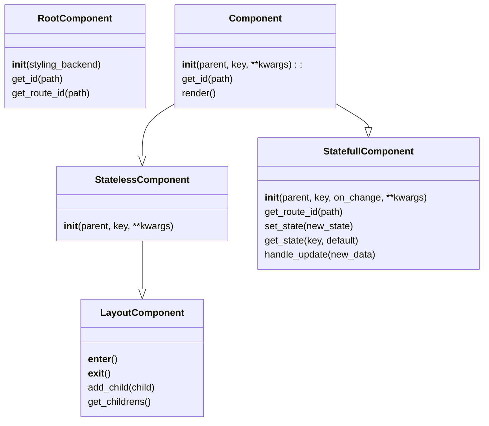

Component Base Classes in `fluidframe/components/base_components.py`:

```mermaid
classDiagram
    class RootComponent {
        __init__(styling_backend)
        get_id(path)
        get_route_id(path)
    }

    class Component {
        __init__(parent, key, **kwargs):
        get_id(path)
        render()
    }

    class StatelessComponent {
        __init__(parent, key, **kwargs)
    }

    class StatefullComponent {
        __init__(parent, key, on_change, **kwargs)
        get_route_id(path)
        set_state(new_state)
        get_state(key, default)
        handle_update(new_data)
    }

    class LayoutComponent {
        __enter__()
        __exit__()
        add_child(child)
        get_childrens()
    }

    Component --|> StatelessComponent
    Component --|> StatefullComponent
    StatelessComponent --|> LayoutComponent
```

